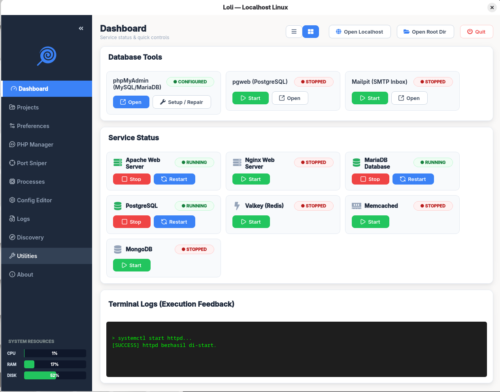
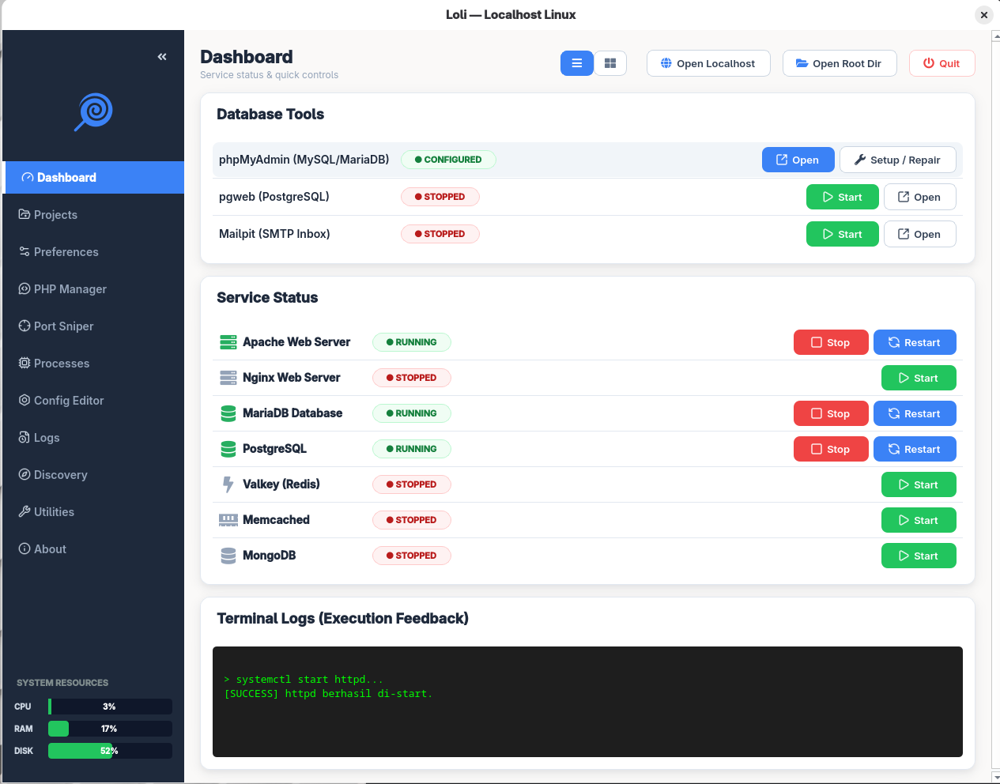

<p align="center">
  
</p>

<p align="center">
  A lightweight desktop control panel for managing your local web development environment on <b>Linux</b>.
</p>

<p align="center">
  
  
  
  
</p>

---

Loli is a Laragon/XAMPP-style GUI control panel (PyQt6) for Linux: control services, manage databases, watch processes, and run local dev utilities — all from a single window. One entry point (`web_panel.py`) serves both distro families; the differences are picked automatically at runtime through `loli/platform_spec.py`:

- **Fedora / RHEL** — httpd, a single php-fpm, `dnf`, automatic SELinux handling, valkey.
- **Debian / Ubuntu** — apache2, multi-version PHP via `a2enmod` / `update-alternatives`, `apt`, redis-server.

Detection reads `/etc/os-release`; force a specific one with the env var `LOLI_PLATFORM=fedora` or `LOLI_PLATFORM=debian`.

## Screenshots

<p align="center">
  
</p>

<p align="center"><i>Dashboard — card view: service status & quick controls</i></p>

<p align="center">
  
</p>

<p align="center"><i>Dashboard — compact list view</i></p>

## Features

- **Dashboard** — start/stop/restart services (Apache, Nginx, MariaDB, PostgreSQL, Redis, Memcached, MongoDB), with an *Install* button for services that aren't yet installed. Switch between **card** and **list** views.
- **Database Tools** — phpMyAdmin (automatic setup), pgweb, and Mailpit (downloaded & launched on demand).
- **Projects** — scan the web root, detect project type (Laravel, WordPress, Node.js, Go, Python, PHP), and quick actions: browser, file manager, terminal, editor.
- **PHP Manager** — version info + extension toggles. On Debian: switch the active PHP version (Apache & Nginx) automatically.
- **Port Sniper** — scan active ports and kill their processes.
- **Process Monitor** — process list + filter + kill.
- **Config Editor** — edit server configuration files.
- **Logs** — tabbed log viewer (journalctl: Apache, PHP-FPM, MariaDB, PostgreSQL, Nginx).
- **Discovery** — a map of the important auto-detected paths.
- **Utilities** — fix permissions, `.test` / `.local` virtual hosts (auto-updates `/etc/hosts`), and database setup (Init PostgreSQL, PostgreSQL Login, MariaDB Passwordless).
- **UI** — status pills, load-colored resource bars, hover states, and a system tray (Laragon-style menu).

## Installation (Fedora — .rpm)

Grab it from [Releases](https://github.com/s4rt4/loli/releases):

```bash
sudo dnf install -y https://github.com/s4rt4/loli/releases/download/v1.0.3/loli-1.0.3-1.fc43.noarch.rpm
loli   # or open "Loli" from your application menu
```

Rebuild from source: `sudo dnf install -y rpm-build`, then `bash packaging/build-rpm.sh` (output lands in `dist/`).

## Running from source

```bash
python3 -m pip install --user PyQt6 psutil qtawesome
python3 web_panel.py        # distro auto-detected (Fedora / Debian / Ubuntu)
```

Third-party assets (not bundled in the repo) are downloaded automatically via the *Download* button in the app: `pgweb`, `phpmyadmin/`, `mailpit`. When Loli is installed system-wide (read-only), downloads are stored per-user under `~/.local/share/loli`.

## Desktop compatibility

| Desktop | Status |
|---------|--------|
| **GNOME** | Works. The tray needs the `gnome-shell-extension-appindicator` extension for the tray icon to show; without it, Loli minimizes normally. |
| **KDE Plasma** | Runs smoothly; the native tray works fully. |
| **XFCE / LXQt / minimal WMs** | Works. Root actions use `pkexec`, so a **polkit authentication agent is required** (e.g. `lxpolkit`, `polkit-gnome`). Loli detects and warns when no agent is running. |

## Architecture

- Privileged operations run via `pkexec` on a **background thread** (`run_async`) so the UI never freezes.
- Logo: `logo.svg`. RPM packaging: `packaging/`.
- Intended for local/development servers, not production.

## License

MIT.
